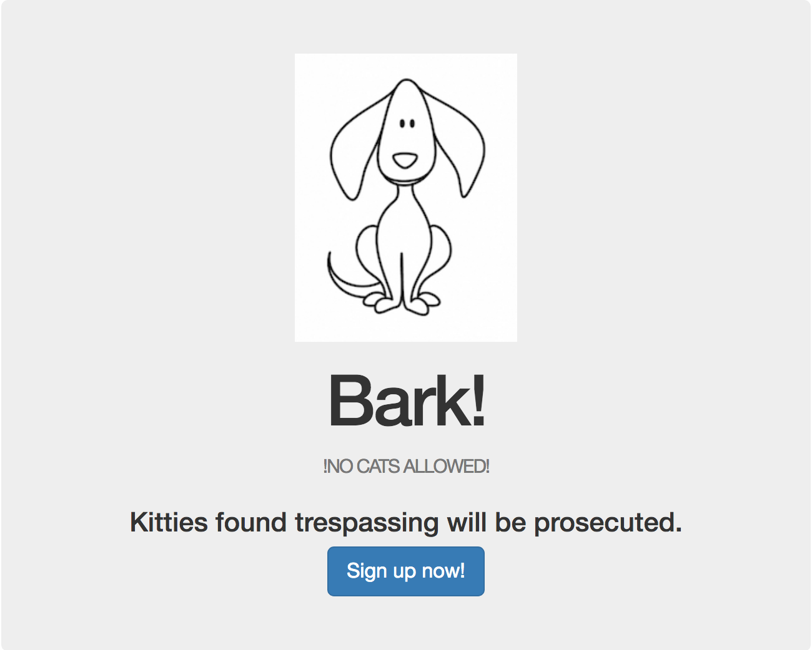
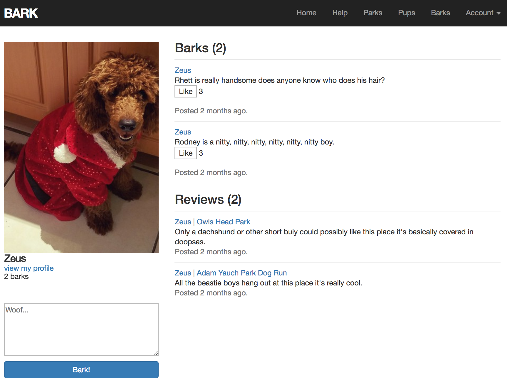
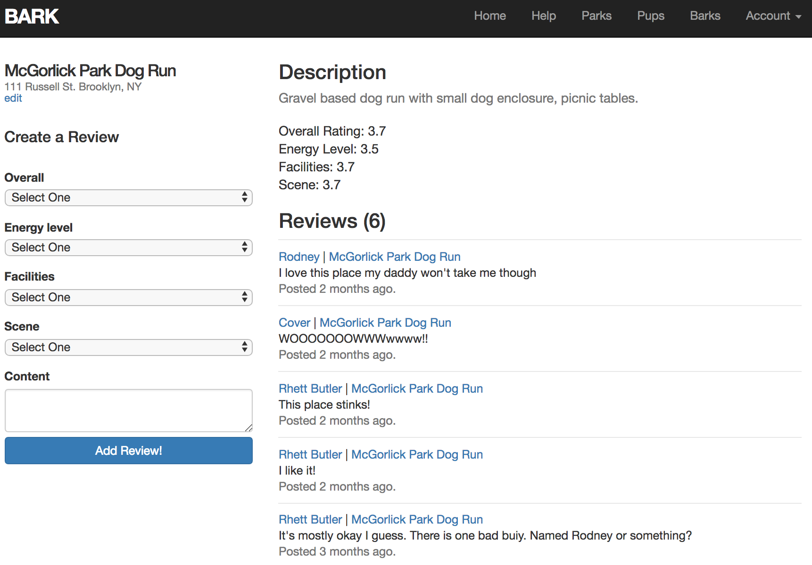
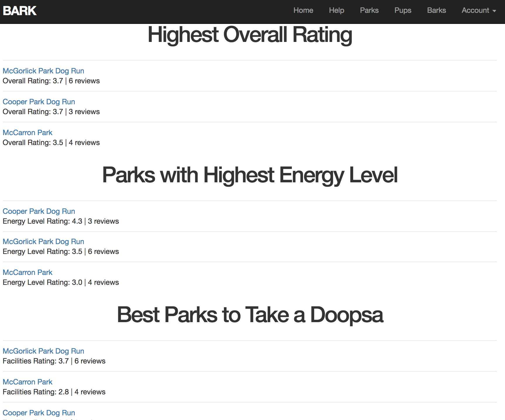

# BARK
BARK is a social media app for doggies, and explicitly NOT for kitties OR humans.

Create an account to review the parks you know about and bark about what's on your mind!

Find a park that's a good fit for you:

* Ruby version  
2.3.3

* System dependencies  
Rails 5.1.4  
Bootstrap 3.3.7  
Rspec-rails 3.7.2

* Configuration  
To get started, fork and clone the repository to your local machine, run bundle install, then run db:migrate to create a database and knock yourself out!

* Testing
Rspec is used to test validations on the three main models.  Ignore the default Rails "Test" folder.  
Run rspec to run all tests.

* Maintenance/Contribution
This repo was more or less a practice run and is not maintained, but that does not diminish the hilarity of this idea.  Please feel free to flesh out any expected functionality!
